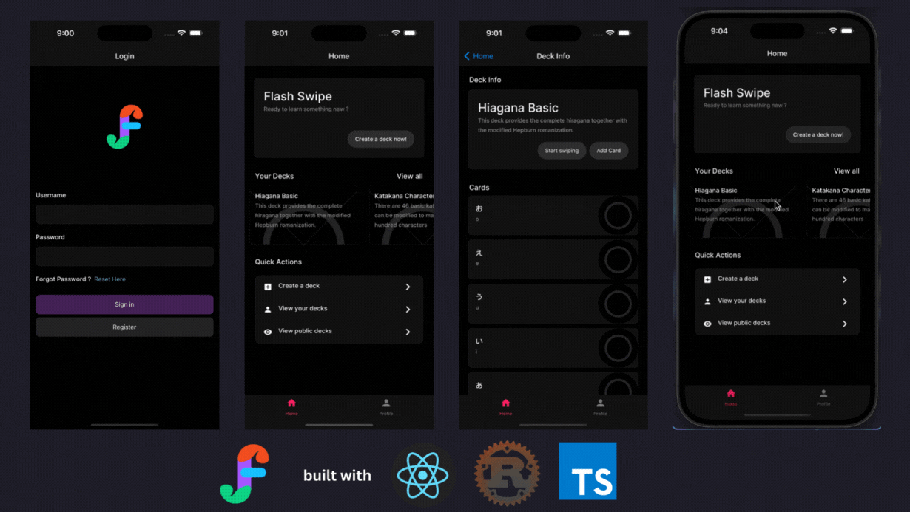

# FlashSwipe

## Background

FlashSwipe is a full-stack mobile app built on top of [React Native](https://reactnative.dev/) + [Rust](https://www.rust-lang.org/)

## Requirements

Make sure you have the following program installed on your dev system

- [Node.js](https://nodejs.org/en)
- [Brew](https://brew.sh/)
- [Make](https://formulae.brew.sh/formula/make)
- [Rust](https://doc.rust-lang.org/book/ch01-01-installation.html)
- [Docker](https://docs.docker.com/get-docker/)

## Database Setup

We will be using docker containers to setup our PostgreSQL database. 
You can use the command `make init_db` that will automatically:  

- create a container named `flashswipe_db_container`
- setup a postgres server inside the container &
- expose it to the default postgres port `5432`

## Running the Backend

You need to create a `.env` file inside the `/backend/` directory with the keys defined inside the `.env.sample` 
After setting up the `.env` file, you can run the application using: `make run` or `cargo run`

## Migrations

If you want to update the database table, please follow the guidelines to add the migration sequence:
`SEQUENCENUMBER_DESCRIPTION.sql` inside the `/migrations` directory
